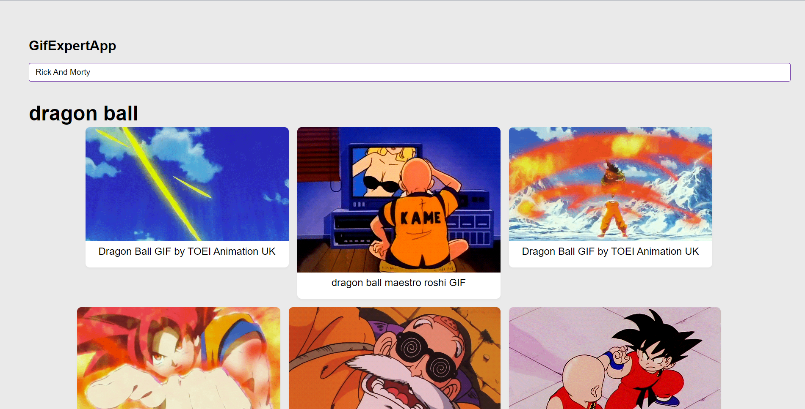

# Gif Expert App

Este proyecto es una aplicación web que muestra GIFs de anime utilizando React y Vite. La aplicación se conecta a una API para obtener los GIFs de anime y los muestra en una interfaz de usuario amigable.

## Características

- Muestra GIFs de anime de alta calidad.
- Permite buscar GIFs por nombre o etiquetas.
- Ofrece una experiencia de usuario rápida y receptiva gracias a Vite y React.
- Actualización en tiempo real de los GIFs a medida que cambian.

## Capturas de pantalla



## Demo

Puedes ver una demostración de la aplicación en [Link del proyecto en Netlify](https://gif-app-yeyo.netlify.app) o [Link del proyecto con GitHub Pages](https://sergio-reinoso.github.io/GifApi-React/).

## Instalación

Asegúrate de tener Node.js y npm instalados en tu sistema antes de seguir estos pasos.

1. Clona este repositorio en tu máquina local:

   ```bash
   git clone https://github.com/sergio-reinoso/GifApi-React.git
   cd tuproyecto

2. Instala las dependencias de node, el proyect lo realice usando pnpm
    ```bash
    pnpm install

3. Inicia la apliacion en modo de desarrollo.
    ```bash
    pnpm run dev